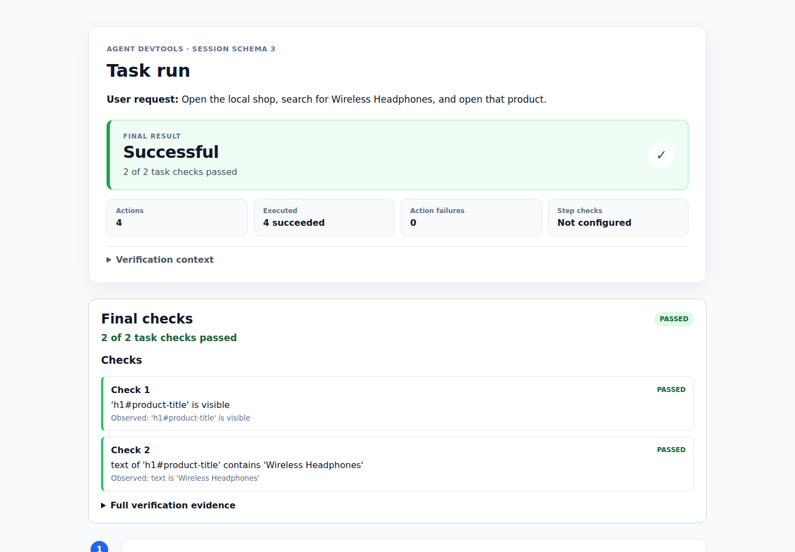

# Agent DevTools

[](https://github.com/YYDongRo/39-tools/actions/workflows/tests.yml)

**Action-level visual debugging and task reliability evaluation for Browser Use
and Playwright agents.**



Agent DevTools wraps an existing agent once and creates a local JSON trace and
HTML report after each run. See what happened, what changed, and whether the
whole task actually finished:

- before-and-after screenshots and page state for supported actions;
- execution status and failure evidence for each action;
- action verification separated from final task verification;
- repeated runs with fresh agents and an aggregate stability report.

The displayed name is **Agent DevTools**. The distribution is `39-tools`, the
Python import name is `agent_devtools`, and the command is `agent-devtools`.

## See a report first

No installation, API key, or agent is needed to inspect these committed examples:

- [Sample failure report](docs/sample-report/report.html): actions execute, but
  the wrong product is opened and the final task check fails.
- [Sample stability report](docs/sample-evaluation/report.html): repeated runs
  show passes, repeated failures, and an unverified attempt.

## Run your Browser Use agent

### Install

Install the fixed alpha release in a new project:

```bash
uv add "39-tools[browser-use] @ git+https://github.com/YYDongRo/39-tools.git@v0.1.0"
uv run playwright install chromium
```

The supported baseline is Python 3.11–3.14, Browser Use 0.13.x, and Playwright
1.61 or newer. The release is not published on PyPI yet.

### Set one provider key

Keep the key in your environment, not in source code or
`agent_devtools.toml`:

```bash
export GOOGLE_API_KEY="your-key"       # Gemini
# export OPENAI_API_KEY="your-key"     # OpenAI instead
```

PowerShell:

```powershell
$env:GOOGLE_API_KEY = "your-key"
```

### Run a task

```bash
uv run agent-devtools \
  --task "Open https://example.com and confirm the Example Domain page is open." \
  --headed --open-report
```

The command runs the agent, prints the report path, and opens the HTML report.
Remove `--headed` for a headless run. If `--task` is omitted, the CLI asks for
the task interactively.

To make one portable local diagnostic archive, add `--export-bundle`:

```bash
uv run agent-devtools \
  --task "Open https://example.com and confirm the Example Domain page is open." \
  --export-bundle
```

The CLI prints a path such as
`bundles/agent-devtools-20260809-test001.zip`. The UTC date stays in the name,
the number increments for each export on that date, and the next date starts at
`test001`. The archive is offline and includes the trace, report, screenshots,
and a small manifest. Review task text, typed values, URLs, and screenshots
before sharing it.

Already have a Browser Use, Playwright, or compatible custom agent? Add the
observer once at its run boundary. See the [Browser Use guide](docs/browser-use.md),
[CLI guide](docs/cli.md), and [Playwright guide](docs/playwright.md) for the
short integration examples.

## Check stability

Run the same Browser Use task with fresh agents:

```bash
uv run agent-devtools \
  --task "Open https://example.com and confirm the Example Domain page is open." \
  --runs 3 --headed --open-report
```

The aggregate report links to every run and highlights repeated failure
patterns. See the [stability evaluation guide](docs/evaluation.md) for details.

## Read the report

| Result | Question it answers |
| --- | --- |
| Execution | Did this operation run, or did it raise an error? |
| Action check | Did this action produce its expected local effect? |
| Task check | Did the complete user request succeed? |

Reports and JSON traces stay local by default. They can contain URLs, typed
values, page text, and screenshots, so review them before sharing. Provider
keys are read from environment variables and are not written to reports. Each
recorded session also includes a collapsed, safe run context (Python, OS, and
installed adapter versions) to help compare local and CI failures; it does not
scan files or save environment variables and executable paths.

## Scope and documentation

Agent DevTools observes supported Browser Use, Playwright, and tool-bound custom
agents. It does not automatically intercept arbitrary direct `page.click()`,
`pyautogui`, desktop, or Android calls. It is not an agent runtime, hosted
dashboard, full replay system, or automatic recovery service.

- [Browser Use guide](docs/browser-use.md)
- [CLI and custom-agent guide](docs/cli.md)
- [Playwright guide](docs/playwright.md)
- [Concepts and optional BYOK judging](docs/concepts.md)
- [Contributing](CONTRIBUTING.md)
- [Security](SECURITY.md)
- [Report an issue](https://github.com/YYDongRo/39-tools/issues)

## Development

```bash
uv sync
uv run pytest
uv build
```

Agent DevTools is available under the [MIT License](LICENSE).
